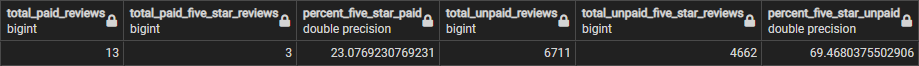

# Amazon Vine Analysis

## Overview

A dataset of Amazon Reviews was extracted into a cloud notebook using Google Colab. This dataset was transformed using PySpark DataFrames and loaded into an AWS RDS using PostgreSQL and pgAdmin. The ETL process was thusly brought into the realm of cloud-based computing and hosting.

One of the resultant tables was further filtered using any of Pandas, PySpark, or SQL. SQL was chosen in order to practice techniques suitable to large datasets.

## Results

There were 13 paid reviews and 6711 unpaid reviews. There were 3 5-star paid reviews and 4662 unpaid reviews. This equates to 23% of paid reviews being 5-star, compared to 69% for unpaid reviews.

## Summary

It appears that paid reviews show a strong bias against 5-star reviews, evidenced by the rate of 5-star unpaid reviews being 3 times higher than for paid reviews. Further hypothesis testing with a Student's t-test would be necessary to state this with more confidence, particularly due to the low sample size of paid reviews.

